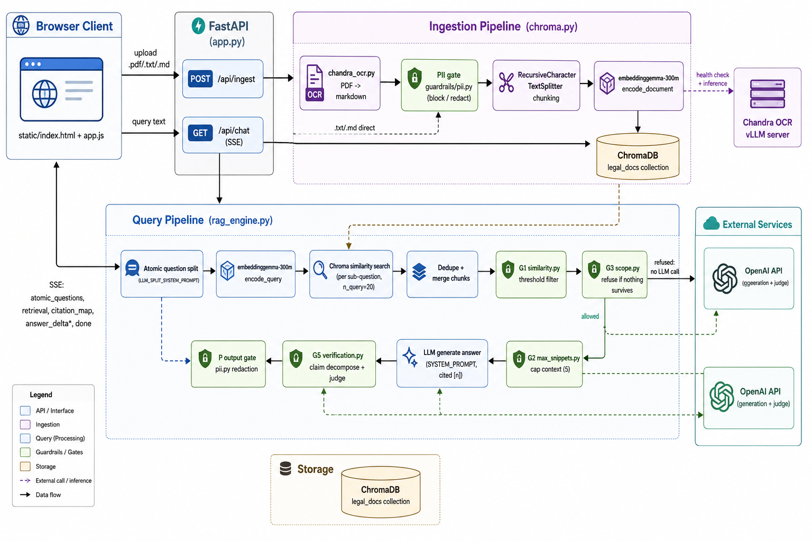

# Architecture

## In a nutshell

A FastAPI app (`app.py`) exposes two flows over a Chroma vector store:

- **Ingestion** (`POST /api/ingest`, `chroma.py`): uploaded `.pdf` files are OCR'd
  into markdown via Chandra OCR (a vLLM server); `.pdf`/`.txt`/`.md` text then
  passes a PII gate (block/redact), gets chunked
  (`RecursiveCharacterTextSplitter`), embedded with `embeddinggemma-300m`, and
  stored in ChromaDB (`legal_docs` collection).

- **Query** (`GET /api/chat`, `rag_engine.py`, streamed over SSE): the user's
  question is first split into atomic sub-questions by the LLM, each of which
  is embedded and searched against Chroma. Retrieved chunks are deduped and
  pass through a chain of guardrails before an answer is generated:
  - **G1** (`similarity.py`) — drop chunks below a similarity threshold
  - **G3** (`scope.py`) — refuse outright (no LLM call) if nothing survives
  - **G2** (`max_snippets.py`) — cap how many chunks go into the prompt
  - LLM generates a cited answer from the surviving context
  - **G5** (`verification.py`) — decomposes the answer into claims and has
    the LLM judge each one against the context, dropping unsupported claims
  - **P** (`pii.py`) — redacts any PII from the final answer before it's
    streamed back to the browser client (`static/index.html` + `app.js`)

All LLM calls (splitting, generation, judging) go to the OpenAI API; OCR
inference goes to a separately hosted Chandra vLLM server.
